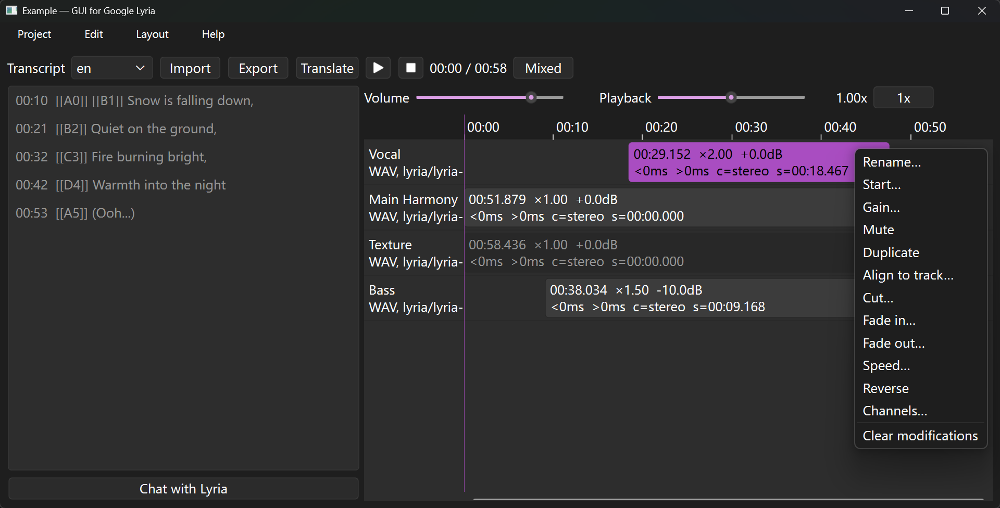

# GUI for Google Lyria

Graphic user interface for generating and editing audio with Google Lyria


## Acknowledgement

Besides Python packages in `requirements.txt` file, this program also uses the following programs.

[librosa](https://github.com/librosa/librosa)  *extracted, modified*


## Install

Create and activate a Python virtual environment.

Run the following command in terminal.

```
pip install -r requirements.txt
```


## Usage

Run the following command in terminal.

```
python main.py
```



The following files are the documentation.

-   [Create a new project](./docs/create_new_project.md)
-   [Configure generative models](./docs/config_gen_models.md)
-   [Generate audios](./docs/gen_audios.md)
-   [Mix tracks in time line](./docs/time_line.md)

