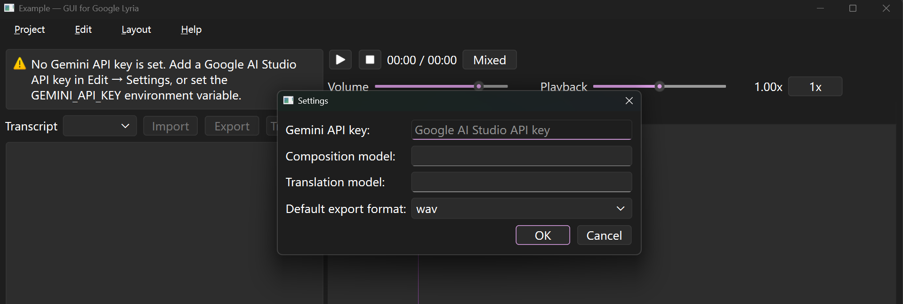

# Configure generative models

Open [Google AI Studio](https://aistudio.google.com/welcome), add billing if needed, and create an API key.

A third-party Gemini-compatible key can work only if requests use the same official API shape.

Open "Edit → Settings…" and paste the key into Gemini API key. The field is a password box; the value is stored in plain text in `settings.json`.

OK is blocked until both the API key and the translation model are filled in. The program then sends a short test prompt (`Reply with the single word OK.`) to that translation model. If the call fails, settings are not saved. The composition model is not required to save settings, but generation will refuse to run until one is set (in Settings or in the chat window).

Settings apply to the whole program, not to a single project. They are written to `settings.json` next to the program (the folder that contains `main.py`, or the folder of a frozen executable).

The same file also stores the recent-project list (up to 12 paths). Changing Settings does not rewrite project files.

## Audio generation

See [Generate music with Lyria 3](https://ai.google.dev/gemini-api/docs/music-generation) and copy a model ID into Composition model.

Default export format is one of `wav`, `flac`, `m4a`, `aac`, or `mp3`. WAV is the recommended default:

- Converting from WAV to a compressed format is lossy. The export can use the target format fully, but information from the WAV is discarded. That conversion is one-way.
- Converting from a compressed format to WAV is lossless for that file: size grows, quality does not improve. Converting back yields the same compressed audio.

That setting is copied onto a new project as its remembered export format. It does not change projects that already exist. Export dialogs still offer every format and suggest a `.wav` filename; if the path has no recognized suffix, the file is saved as WAV.

The program’s on-disk format is not always the format the model returns. Generated audio is stored under `media/audio/` as WAV whenever the bytes can be decoded (MP3 from Clip is converted to WAV). The models below are handled explicitly:

| Model ID | LLM output format | Description |
| --- | --- | --- |
| `lyria-3-clip-preview` | MP3 | No WAV option; the program keeps the provider default, then converts to WAV for the project when decoding succeeds. |
| `lyria-3-pro-preview` | WAV | The program requests WAV with `response_format: { "type": "audio" }`, following [select output format](https://ai.google.dev/gemini-api/docs/music-generation#output-format). Any model ID whose name contains `pro` (case-insensitive) gets the same request. |

If the model ID is not in that table and does not contain `pro`, the provider’s default output is used. Audio is treated as stereo. If duration cannot be read, the track is recorded as 30 seconds.

## Lyrics translation

See [All models](https://ai.google.dev/gemini-api/docs/models) and copy a text model ID into Translation model.

That model translates the selected track’s lyrics into another language (BCP-47 codes such as `zh`, `ja`, `fr`). Timestamps, `[[section]]` tags, and LRC id tags are kept; only the sung or spoken words are translated. The call uses temperature `0.2` and does not use tools. If the model wraps the result in a markdown code fence, the fence is stripped.

A translation model ID is required even if you never translate lyrics, because Settings uses that model to check the API key.

