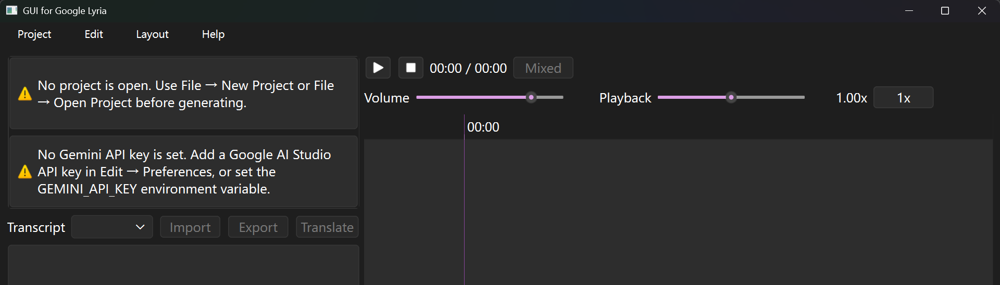
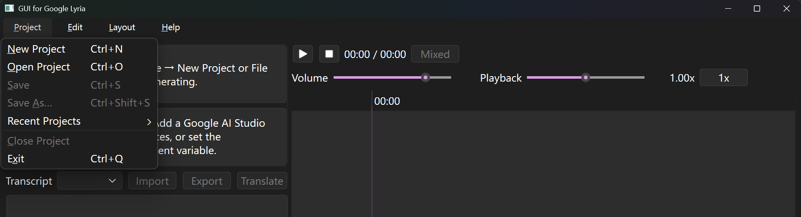

# Create a new project

When the program starts with no project and no API key, two warning banners appear in the left column. They stay until a project is open and a Gemini API key is saved in settings. The program does not reopen the last project automatically.

Create a project with "Project → New Project" (`Ctrl+N`).

Choose a folder. That folder becomes the project: its name is the project name, and all media, lyrics, and conversation history are stored inside it.

Prefer an empty folder. If the folder already has files (other than ignored leftovers such as `Thumbs.db` or `.DS_Store`) and it is not already a project, the program asks whether to create a project there anyway. Cancel leaves the folder unchanged.

## What is created

A new project writes these files and folders immediately:

| Path | Role |
| --- | --- |
| `project.json` | Project metadata |
| `conversation.json` | Chat threads with Lyria |
| `tracks.json` | Tracks and mix placements |
| `media/audio/` | Generated and imported audio |
| `media/images/` | Images attached in chat |
| `transcripts/` | Lyrics as LRC files |

A blank conversation titled New conversation is created at the same time. Its composition model is copied from "Edit → Settings".

These project values are not shown in the New Project dialog. They are stored in `project.json` and stay with that project:

| Field | Default | Notes |
| --- | --- | --- |
| Sample rate | 44100 Hz | Mixes and exports are rendered at this rate |
| Channel layout | stereo | Mix output layout |
| Export format | copied from Settings, otherwise `wav` | Remembered on the project; the export dialog still suggests a `.wav` filename |
| MP3 quality | `0` | Highest quality when exporting MP3 (0–9, lower is better) |
| Clip protection | `headroom` | If the mix peaks above 0 dBFS, levels are scaled so the peak is 0.99. There is no UI to switch this to a limiter |

## Open, save, and close

- "Project → Open Project" (`Ctrl+O`) loads a folder that already contains `project.json`. A folder without that file is rejected.
- "Project → Recent Projects" lists up to 12 folders, most recent first. Opening or creating a project moves it to the top. The list is stored in the program’s `settings.json`, not in the project.
- "Project → Save" (`Ctrl+S`) writes the three JSON files. Generation, audio import, and lyric import/translate save on their own. Timeline edits (move, gain, mute, effects, undo) only mark the project dirty until you save. An unsaved project shows `*` in the window title.
- "Project → Save As…" (`Ctrl+Shift+S`) copies the whole project folder into another folder, then switches to the copy. If that folder is not empty, you are asked to confirm.
- "Project → Close Project" unloads the project. "Project → Exit" (`Ctrl+Q`) closes the program.

If the project has unsaved edits, New, Open, Close, and Exit ask Save, Discard, or Cancel. No is the default on yes/no prompts elsewhere; this dialog has no default save.

Playback stops when the project is switched or closed. The chat window, if open, is cleared and reloaded for the new project.

## Main window layout

The window opens at about 75% of the screen width (capped by a 16:10 ratio). The left column is the transcript panel; the right column is the player and timeline, at a 1:2 width ratio. "Layout → Reset Layout" restores that split and shows the transcript panel again. "Layout → Toggle Transcript panel" (`Ctrl+T`) hides or shows the left column.

