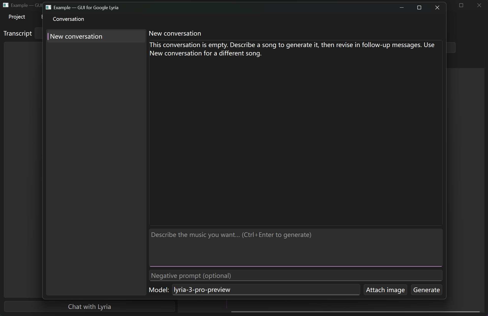
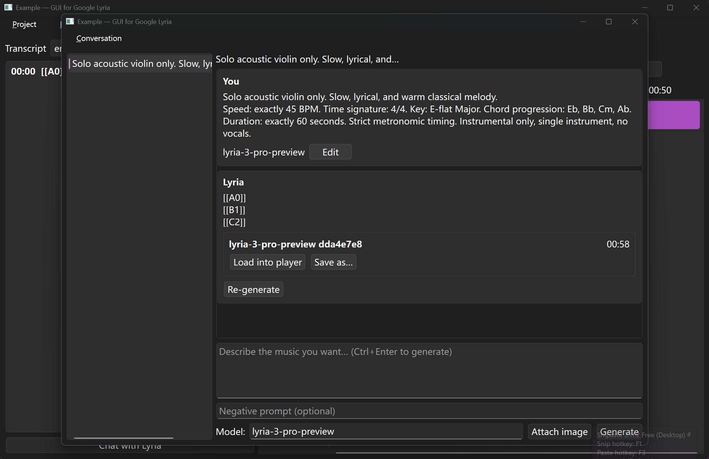
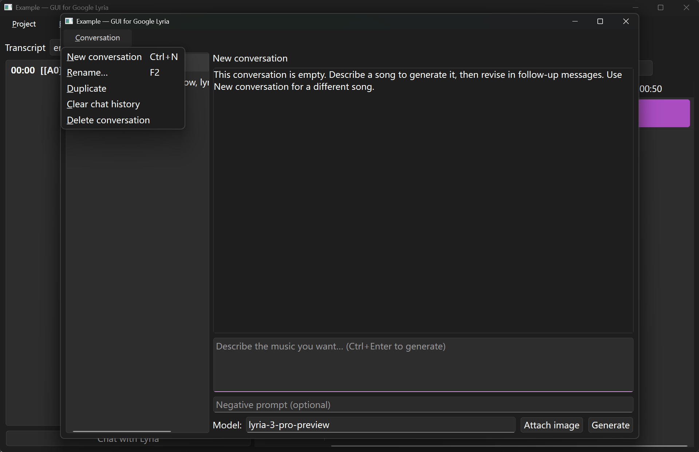

# Generate audios

## Input

Open the chat window with "Chat with Lyria" in the main window, "Layout → Chat with Lyria", or `Ctrl+L`. The window is separate from the main window. Closing it destroys it; the next open reloads conversations from the project. The prompt box is focused on open.

Generation needs an open project and a Gemini API key. If either is missing, the same warning banners shown on first launch appear in this window, and "Generate" does not call the API.

The "Model" field starts from, in order: the conversation’s saved model, the model used on the latest generation in that thread, then "Composition model" in "Settings". Editing the field and leaving it writes that model onto the current conversation (the project is saved). An empty field falls back to Settings. During a run the field is read-only.

Type in the prompt box (what the model should follow) and, optionally, the negative prompt (what it should avoid). The negative prompt is sent as a second text part: `Negative prompt (avoid): …`. An empty prompt does nothing; whitespace is ignored. `Ctrl+Enter` in the prompt box is the same as Generate. Prompt-writing notes: [Lyria music generation prompt guide](https://docs.cloud.google.com/gemini-enterprise-agent-platform/models/music/music-gen-prompt-guide).

Attach image adds one or more files (`*.png`, `*.jpg`, `*.jpeg`, `*.webp`, `*.gif`). Unknown suffixes are sent as `image/png`. Each attachment can be removed with × before you generate. Images are copied into `media/images/` when the turn is stored.

Generate sends the current prompt, negative prompt, and attachments. Only one generation can run at a time. While it runs, the button reads Generating…, the prompt is read-only, conversation menu items are disabled, and Edit / Re-generate on older bubbles are disabled. A follow-up Generate sends only the new prompt (plus images on that turn). Earlier messages in the thread are not sent as model history. Use Re-generate when the previous turns should be included.

## Output

The model replies with text (often lyrics) and one or more audio files.

Each audio file becomes a track on the timeline, named `{model id} {first 8 hex chars of a new id}`, placed at time `0` with gain `0.0 dB` and unmuted. The latest new track is selected and loaded into the player. If that does not happen, Load into player on the audio chip does the same.

"Save as…" on the chip exports that track’s rendered audio (original plus any later effects). The dialog suggests `{track name}.wav` and offers WAV, FLAC, M4A, AAC, and MP3. AAC and M4A use 192 kbps. MP3 uses the project’s quality value (default `0`, highest).

Lyrics from the reply are stored as English LRC (`en`, source `lyria_lyrics`) when they can be parsed. If no timestamps are found, the whole text becomes one cue from `0` to the audio duration (or 30 seconds if duration is unknown).

After a successful Generate (not Re-generate), the prompt, negative prompt, and attachments are cleared. A default conversation is titled from the first prompt line, trimmed to 48 characters.

Edit removes that user message and everything after it, then restores the prompt and attachments. Re-generate removes the assistant reply and calls the model with the full stored thread as history without adding another user message.

## Multiple conversations

Use "Conversation" to create, rename, duplicate, clear, or delete the current thread.

Right click conversation title in the left column, these functions are available for any existed selected conversation as well.

These actions are disabled while generation is in progress. A new conversation uses the Settings composition model. A blank rename restores New conversation. Duplicate creates `{name} (copy)` and new message ids. Clear and delete conversations do not delete generated tracks. Deleting the last thread creates a fresh empty one; deleting the last empty thread is ignored. `Delete` on the list skips confirmation, while the menu action asks first.

Switching threads saves the current model field onto the thread being left. Earlier turns are not sent for ordinary Generate; use Re-generate for that behavior.

