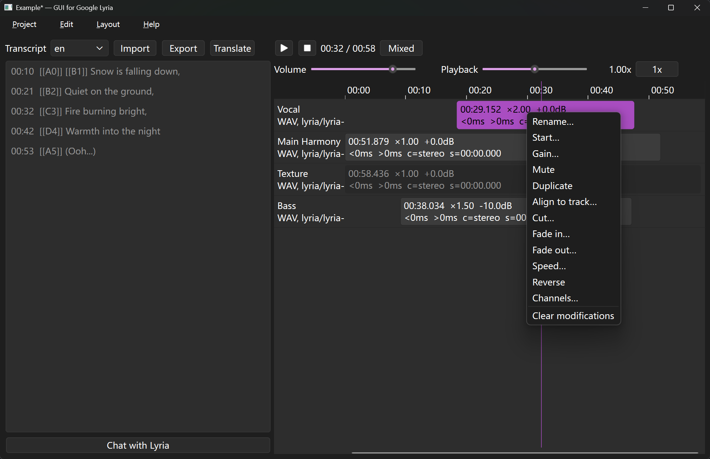
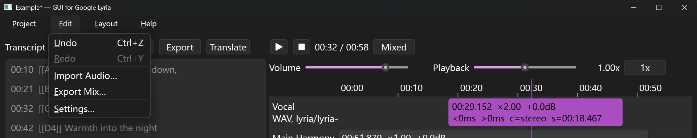

# Mix tracks in time line

After clips are generated, mix them in the main window. Tracks sit in the right column, on the timeline. The player is above it.

Besides audios generated by generative model, import external audio with "Edit → Import Audio…" if needed, then choose a file (`*.wav`, `*.mp3`, `*.flac`, `*.ogg`, `*.oga`). The file is copied into `media/audio/`; the original path is not used after that. The track name is the file stem. It is placed at time `0`, gain `0.0 dB`, unmuted. Import saves the project immediately. If probing the file fails, the copy is deleted and nothing is added.

## Playback

Click a clip to select it and load only that clip into the player. The clip still sits at its mix start time: silence plays until that offset, then the clip, then silence until the mix end. Clicking empty space in a lane also selects that track, loads it, and moves the playhead.

Mixed clears the track selection and loads every unmuted clip as one mix, then starts playback. Muted clips are omitted. If every clip is muted, the mix is a tiny silent buffer.

Transport:

- Play / Pause and Stop sit to the left of the clock (`mm:ss / mm:ss`).
- Volume defaults to 80. It is master output level only; it is not stored on the project.
- Playback is listen-only speed, 0.25×–4.00× on a log slider, pitch always preserved. It is not the same as the "Speed…" clip effect. 1x resets it to 1.00×. Neither control is saved.
- Play from the end rewinds to the start. Scrolling or seeking onto the end does not loop.

Click the ruler, or empty space in a lane, to move the playhead. Scroll over the timeline (or most of the main window) to nudge it by 1 second per scroll line; scroll down moves forward. `Ctrl+scroll` on the timeline zooms around the pointer (minimum span 1 second). When zoomed in, the bottom bar pans the visible range. The default view fits the whole mix and grows as clips are added.

Selecting a clip for editing does not interrupt playback. Only a left-click that activates a clip, Mixed, or Load into player from chat changes what the player is rendering.

## Clip menu

Right-click a clip (or its lane) for mix and source edits. "Help → Time line" repeats the mouse and label notes below. Effects are stored on the track and applied in order; the original file is not overwritten. "Edit → Undo" (`Ctrl+Z`) / "Redo" (`Ctrl+Y`) cover mix and effect changes, not chat history. They stay in memory until the project is closed.

| Action | What it does | Defaults / limits |
| --- | --- | --- |
| Rename… | Changes the track name | Empty or unchanged names are ignored |
| Start… | Sets mix start time | `MM:SS.mmm` or a millisecond count; cannot be negative |
| Gain… | Mix level in dB | Range −60 to +24, one decimal; default `0.0` |
| Mute / Unmute | Omits the clip from Mixed and export mix | Single-track preview still plays. Muted clips are drawn faded |
| Duplicate | New track sharing the same media file | Name `{name} copy`; copies start, gain, mute, and the effect chain; inserted on the next row |
| Align to track… | Places this clip relative to another | Default is this clip’s start to the other clip’s end, gap `0 ms`. Gap may be negative (overlap), ±1 hour. Needs at least one other track |
| Cut… | Keep or remove a time range | Start `0`, end = current duration, mode Keep this range. Times are milliseconds |
| Fade in… / Fade out… | Fade at the start or end | Duration `500` ms, shape Linear (or Exponential, a sine quarter-turn) |
| Speed… | Changes duration | Ratio `1.00` (0.01–10.00). Preserve pitch is on; that uses a phase vocoder. Off resamples and changes pitch |
| Reverse | Plays the source backwards | No dialog |
| Channels… | Converts layout | Default Make stereo, pan Center. Pan applies only to stereo (−100% left to +100% right). Also Make mono and Make 5.1 |
| Clear modifications | Drops the effect chain | Asks first. Mix start, gain, and mute are kept. Original audio is untouched |

`Delete` on the timeline removes the selected track (undo brings it back). There is no confirmation. Neighbour selection moves to the next row, or the previous if that was the last.

Drag a clip left or right to change start time (not before 0). Drag up or down to reorder rows. A 4-pixel slop avoids accidental drags.

Each row label shows the track name, file format, and source (`lyria/{model}` or `imported`). Inside the clip, line 1 is rendered duration, speed factor, and mix gain; line 2 is fade in, fade out, channel layout, and start time. Overflow is hidden; hover the clip for the full tooltip.

## Lyrics

When a track is selected, its lyrics appear in the left column. Generated lyrics default to language `en`. The language box switches among stored versions.

- Click a cue to seek to that line (plus the clip’s start offset). During playback the current line is bold.
- Import reads LRC (or a `.txt` that contains `[mm:ss.xx]` tags). You are asked for a language code; the current one is the default. Encoding is tried as UTF-8 with BOM, UTF-16, then UTF-8.
- Export writes LRC with `[ti:]` and `[la:]` tags. The suggested name is `{track name}.lrc`.
- Translate asks for a target BCP-47 code, calls the translation model from Settings, and stores a new language version. Existing lyrics for that code are replaced only after confirmation. Timestamps are taken from the source so playback stays aligned.

Import, Export, and Translate need a selected track. Export and Translate also need cues. They are disabled while a translation is running.

## Export mix

"Edit → Export Mix…" writes the current mix (unmuted clips, with effects, gain, and offsets) to a file. The suggested name is `{project folder name}.wav`. Formats match Save as… on a chat audio chip. AAC/M4A are 192 kbps; MP3 uses the project quality (default `0`).

Hidden mix behavior:

- Mix sample rate is 44100 Hz; output layout is stereo. Both are stored on the project and have no Settings control.
- If the summed mix exceeds 0 dBFS, headroom scales the whole mix so the peak is 0.99. That mode is fixed in the UI.
- Single-track preview does not apply mix gain or mute; those affect Mixed and "Export Mix…" only.
- Rendered effect chains are cached in memory for the session. Closing or switching the project clears the cache.

